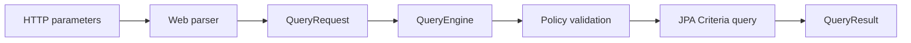

# Architecture

CriteriaForge is a modular Java library built around a framework-independent query model. Each integration is kept in its own Maven module so applications can depend only on the capabilities they use.

Spring Boot auto-configuration wires the selected modules when they are present.

## Consumer API

A normal application only needs five concepts:

| Concept | Responsibility |
|---|---|
| `QueryRequest` | Describes selected fields, filters, sorting, and pagination |
| `Filters` | Builds programmatic filter expressions when HTTP is not the input |
| `QueryPolicy` | Limits the fields, operators, relationships, and complexity callers may use |
| `QueryEngine` | Validates and executes a request for a JPA entity |
| `QueryResult` | Returns content, total count, offset, and limit |

`QueryEngine.execute(...)` chooses entity or projected execution from the request. Controllers do not branch on projection details.

`FilterExpression` is an opaque composition type. Application code creates expressions with `Filters.eq(...)`, `Filters.and(...)`, `Filters.or(...)`, and `Filters.not(...)`; the concrete expression nodes are internal to the core module. The visitor exposed by `FilterExpression` exists for persistence-adapter implementations, not normal application code.

## Module responsibilities

| Module | Actual responsibility |
|---|---|
| `criteriaforge-core` | Describes a query without knowing HTTP or JPA |
| `criteriaforge-spring-web` | Converts HTTP parameters into that description |
| `criteriaforge-jpa` | Converts the description into a JPA query |
| `criteriaforge-spring-boot-autoconfigure` | Creates the necessary Spring beans |
| `criteriaforge-spring-boot-starter` | Convenience dependency |
| `criteriaforge-example` | Demonstrates usage |

Framework-specific modules depend on the smaller modules they extend. Core cannot reference Spring, JPA, servlet APIs, JSON libraries, or RPC libraries; an automated dependency rule enforces this boundary.

## Application responsibilities

CriteriaForge handles query description, validation, and execution. It does not define an application's domain architecture. A consuming application typically:

1. Creates `QueryRequest` from HTTP parameters or application code.
2. Authenticates and authorizes the caller, selects the entity and effective query policy, and applies mandatory scope.
3. Calls `QueryEngine`, which validates and executes the JPA query.
4. Maps `QueryResult` into its own public response contract.

Business decisions, workflows, invariants, authorization, and orchestration remain in the consuming application. CriteriaForge only removes repetitive dynamic-query construction.

## Query execution

The JPA module performs metadata-only preflight validation before creating executable queries. Content and count queries are built independently because Criteria roots and joins cannot be shared between them. Identifier ordering comes from the metamodel. To-many filtering enables distinct content and count behavior. Projection aliases retain complete paths and are assembled into insertion-ordered nested maps.

## Extension points

- Create `QueryRequest` from another input mechanism without changing core or JPA.
- Replace `QueryPolicyProvider` for endpoint- or entity-specific exposure.
- Replace auto-configured beans with normal application beans.
- Build another persistence integration from the core query model only when its operator semantics are explicit and separately tested.

Generic write operations, controllers, response envelopes, and domain abstractions are intentionally outside the project.
