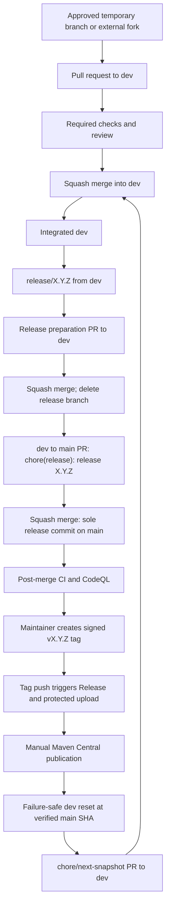

# Branch and release workflow

`main` is the default branch and official release ledger. `dev` is the integration branch. The only pull request with `main` as its destination is exact `dev` for a release; approved temporary branches and external forks target `dev`.



## Temporary branches and pull requests

Contributors branch from current `dev`. Same-repository temporary branches must use one of these prefixes:

- `feature/`
- `fix/`
- `docs/`
- `refactor/`
- `test/`
- `build/`
- `ci/`
- `chore/`
- `release/`
- `dependabot/`

External fork branch names are accepted. The prefix policy applies only to branches owned by the CriteriaForge repository. All temporary branches and forks open pull requests to `dev`; `dev` alone opens the release pull request to `main`.

Temporary branches may contain multiple development or fixup commits. GitHub writes one squash commit to `dev` for each merged pull request. Pull request titles become that commit title and must use an approved Conventional Commit type: `feat`, `fix`, `docs`, `refactor`, `test`, `build`, `ci`, `chore`, `perf`, or `revert`. Scopes are optional.

Only squash merging is enabled. Resolve review conversations and update the pull request with current destination branch before merging. Same-repository short-lived source branches are automatically deleted after merge; GitHub cannot delete a branch in a contributor's fork.

The `dev` to `main` release pull request is the sole exception to the general title rule: it must originate from exact `dev` and must have the exact title `chore(release): release X.Y.Z`. It must also carry exactly matching stable Maven version `X.Y.Z` and a dated `CHANGELOG.md` heading `## [X.Y.Z] - YYYY-MM-DD`.

## Required checks and protection

The permanent branch rulesets protect `dev` and `main` against direct pushes, force pushes, and deletion; require linear history, pull requests current with the destination branch, resolved review conversations, and squash-only merges. They require these exact checks:

- `pr-policy`
- `build-java17-boot3`
- `build-java17-boot4`
- `postgresql`
- `quality`
- `dependency-review`
- `codeql-java`

No approving review is required while only one eligible maintainer exists. Every release still requires complete maintainer review. When a second eligible maintainer exists, maintainers increase the required approval count for both permanent-branch rulesets to one.

## Controlled `dev` reset after a release

`protect-dev` is active, blocks deletion, and has no bypass actor. The reset is an exceptional maintainer operation, not a direct-push exception. Run this only after the release has completed its required post-merge checks and manual Central publication. Do not start if the SHA/tree or open-pull-request checks fail.

The following procedure temporarily disables only the live ruleset named `protect-dev`, records its full definition, recreates `dev` at the verified `main` commit, and restores the saved definition even if deletion or recreation fails. Cleanup re-queries that exact ruleset whenever its saved payload exists; any state other than `active`, including an empty result from an ambiguous API failure, triggers restoration. It requires an authenticated maintainer GitHub CLI session; replace `REPOSITORY` only when operating the intended repository.

```bash
set -euo pipefail

REPOSITORY="EmmanuelCazarez/criteriaforge"
RESET_DIR="$(mktemp -d)"

restore_protect_dev() {
  jq '.enforcement = "active" | {name, target, enforcement, bypass_actors, conditions, rules}' \
    "${RESET_DIR}/protect-dev-before.json" > "${RESET_DIR}/protect-dev-active.json"
  gh api --method PUT "repos/${REPOSITORY}/rulesets/${RULESET_ID}" \
    --input "${RESET_DIR}/protect-dev-active.json" >/dev/null
}

cleanup() {
  status=$?
  local live_enforcement
  set +e
  if [[ -n "${RULESET_ID:-}" && -s "${RESET_DIR}/protect-dev-before.json" ]]; then
    live_enforcement="$(gh api "repos/${REPOSITORY}/rulesets/${RULESET_ID}" --jq '.enforcement' 2>/dev/null)"
    if [[ "${live_enforcement}" != "active" ]]; then
      if ! restore_protect_dev; then
        printf 'ERROR: could not restore protect-dev; saved payload retained at %s\n' "${RESET_DIR}" >&2
        trap - EXIT
        exit "${status}"
      fi
    fi
  fi
  rm -rf "${RESET_DIR}"
  trap - EXIT
  exit "${status}"
}
trap cleanup EXIT

git fetch --prune origin main dev
MAIN_COMMIT="$(git rev-parse origin/main)"
test "$(gh api "repos/${REPOSITORY}/branches/main" --jq '.commit.sha')" = "${MAIN_COMMIT}"
MAIN_TREE="$(git rev-parse "${MAIN_COMMIT}^{tree}")"
DEV_TREE="$(git rev-parse origin/dev^{tree})"
printf 'main commit=%s\nmain tree=%s\ndev tree=%s\n' \
  "${MAIN_COMMIT}" "${MAIN_TREE}" "${DEV_TREE}"
test "${MAIN_TREE}" = "${DEV_TREE}"
test "$(gh pr list --repo "${REPOSITORY}" --base dev --state open --json number --jq 'length')" = "0"

RULESET_ID="$(gh api --paginate "repos/${REPOSITORY}/rulesets" \
  --jq '[.[] | select(.name == "protect-dev" and .target == "branch")] | if length == 1 then .[0].id else empty end')"
test -n "${RULESET_ID}"
gh api "repos/${REPOSITORY}/rulesets/${RULESET_ID}" \
  > "${RESET_DIR}/protect-dev-before.json"
jq -e '.name == "protect-dev" and .target == "branch" and .enforcement == "active" and .bypass_actors == [] and .conditions.ref_name.include == ["refs/heads/dev"] and any(.rules[]; .type == "deletion")' \
  "${RESET_DIR}/protect-dev-before.json" >/dev/null
jq '.enforcement = "disabled" | {name, target, enforcement, bypass_actors, conditions, rules}' \
  "${RESET_DIR}/protect-dev-before.json" > "${RESET_DIR}/protect-dev-disabled.json"
gh api --method PUT "repos/${REPOSITORY}/rulesets/${RULESET_ID}" \
  --input "${RESET_DIR}/protect-dev-disabled.json" >/dev/null
test "$(gh api "repos/${REPOSITORY}/rulesets/${RULESET_ID}" --jq '.enforcement')" = "disabled"

gh api --method DELETE "repos/${REPOSITORY}/git/refs/heads/dev" >/dev/null
gh api --method POST "repos/${REPOSITORY}/git/refs" \
  -f ref="refs/heads/dev" -f sha="${MAIN_COMMIT}" >/dev/null
test "$(gh api "repos/${REPOSITORY}/branches/dev" --jq '.commit.sha')" = "${MAIN_COMMIT}"

restore_protect_dev
jq -e '.name == "protect-dev" and .target == "branch" and .enforcement == "active" and .bypass_actors == [] and .conditions.ref_name.include == ["refs/heads/dev"] and any(.rules[]; .type == "deletion")' \
  <(gh api "repos/${REPOSITORY}/rulesets/${RULESET_ID}") >/dev/null
```

If any command before deletion fails, the procedure changes nothing. If a command after the temporary disable fails, the exit trap restores the exact saved `protect-dev` definition before it exits. If the restoration API call itself fails, stop all release work and reapply the recorded active ruleset definition before any further action. Do not continue to the next-snapshot pull request until the final active-ruleset and recreated-branch checks pass.

A focused static assertion for the ambiguous-disable recovery path is:

```bash
cleanup_body="$(sed -n '/^cleanup()/,/^}/p' docs/branching.md)"
printf '%s\n' "${cleanup_body}" | rg -q '\-n "\$\{RULESET_ID:-\}"'
printf '%s\n' "${cleanup_body}" | rg -q '\-s "\$\{RESET_DIR\}/protect-dev-before\.json"'
printf '%s\n' "${cleanup_body}" | rg -q 'live_enforcement=.*gh api'
printf '%s\n' "${cleanup_body}" | rg -q 'if \[\[ "\$\{live_enforcement\}" != "active" \]\]; then'
printf '%s\n' "${cleanup_body}" | rg -q 'restore_protect_dev'
if printf '%s\n' "${cleanup_body}" | rg -q 'RULESET_DISABLED'; then
  exit 1
fi
printf 'ambiguous-disable-static-assertion=pass\n'
```


## Release lifecycle

1. Confirm `dev` is green and all intended work is integrated.
2. Create `release/X.Y.Z` from `dev`, set the reactor to stable `X.Y.Z`, and update the dated changelog.
3. Squash-merge `release/X.Y.Z` into `dev`; the release branch is deleted.
4. Open exact `dev` to `main` with exact title `chore(release): release X.Y.Z`; all checks and complete maintainer review are required.
5. Squash-merge once, creating the sole release commit on `main`, then wait for post-merge CI and CodeQL on that exact commit.
6. A maintainer creates and locally verifies signed tag `vX.Y.Z` on that exact commit, then pushes it. The tag-push-triggered `Release` workflow validates the signed candidate and uploads the intended artifacts through protected `maven-central`; a `main` merge alone does not publish.
7. The Central publication remains a separate manual approval after validation. `workflow_dispatch` may rerun an existing signed tag but never replaces it.
8. Run the [controlled `dev` reset procedure](#controlled-dev-reset-after-a-release), then create a short-lived `chore/next-snapshot` branch from the recreated `dev` to advance the next snapshot and squash-merge it back into `dev`.

Use `0.2.0` when backward-compatible features are introduced. Fixes and refactors alone normally use a patch increment.

## Automation inventory

The repository has three GitHub Actions workflows:

1. **`CI`** runs for pull requests and pushes on `dev` and `main`, plus manual dispatch. Java 17/Spring Boot 3, Java 17/Spring Boot 4, PostgreSQL, and quality run for those triggers; policy validation and dependency review are pull-request-only.
2. **`CodeQL`** runs for pull requests and pushes on `dev` and `main`, on its weekly schedule, and through manual dispatch.
3. **`Release`** runs for pushed signed `v*.*.*` tags and can be manually rerun only for an existing signed version. A merge to `main` alone does not publish. Its `publish` job, protected by the `maven-central` environment, uploads the signed bundle; Maven Central publication remains a separate manual approval.

Dependabot is separate from those three GitHub Actions workflows. It creates weekly Maven and GitHub Actions update pull requests targeting `dev`.

## Historical governance boundary

The first 38 `main` commits and signed `v0.1.0` are retained as legacy history. The governance migration adds one final non-release correction commit. The one-release/one-commit invariant starts prospectively at the resulting freeze baseline; no claim is made that historical `main` retroactively contains only release commits.

See [Contributing](../CONTRIBUTING.md) for local checks, [Releasing](../RELEASING.md) for operating steps, and [Architecture](architecture.md) for module boundaries.
